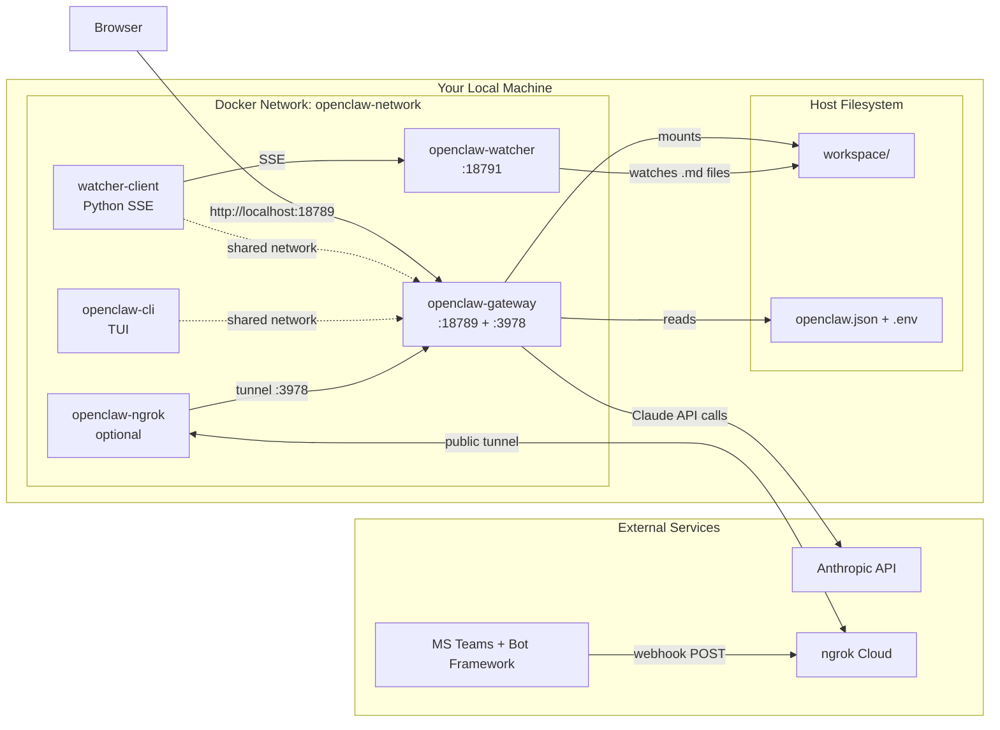
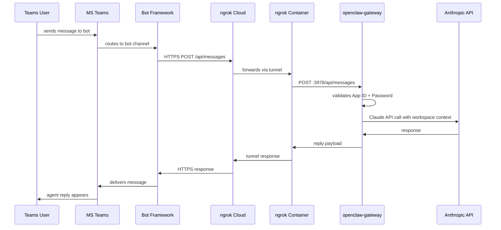
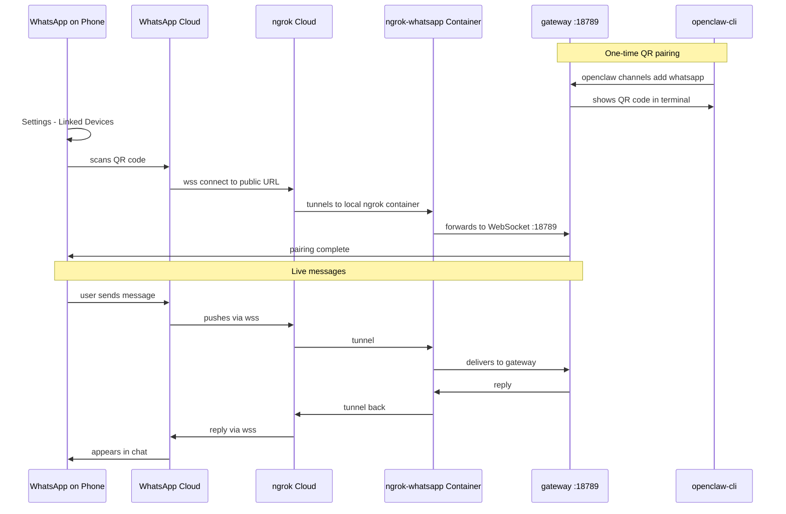
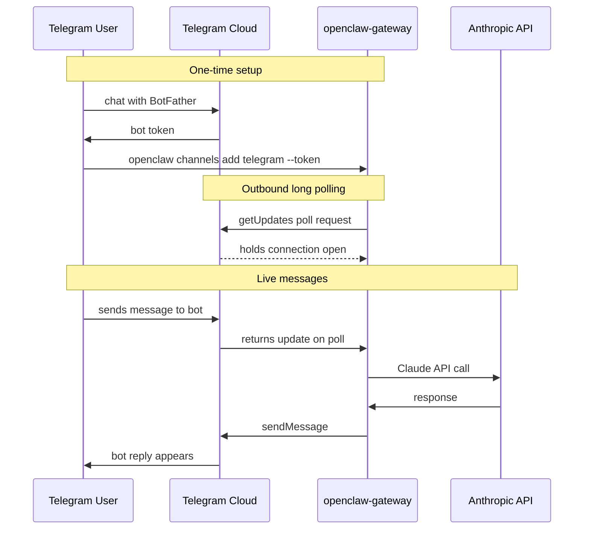

# openclaw-starter

A ready-to-run template for deploying a self-hosted AI agent on your local machine using Docker.

Your agent runs as a persistent gateway — accessible via a **web UI**, **terminal TUI**, and optionally **Microsoft Teams**. The workspace (personality, rules, skills, knowledge) lives as plain markdown files you edit directly. Changes reload live without restarting containers.

---

## What's Included

| Component | Description |
|---|---|
| `setup.sh` | Interactive wizard — asks for your credentials, generates `.env` + `openclaw.json`, optionally starts the stack |
| `docker-compose.yml` | 4-service stack (gateway, watcher, watcher-client, cli) |
| `docker-compose.teams.yml` | Optional overlay — ngrok tunnel for Microsoft Teams |
| `docker-compose.whatsapp.yml` | Optional overlay — ngrok WSS tunnel for WhatsApp QR pairing |
| `docker-compose.telegram.yml` | Optional overlay — injects Telegram bot token (no tunnel needed) |
| `entrypoint.sh` | Smart Python dep installer — hash-based cache, skips reinstall if unchanged |
| `requirements.txt` | Python packages installed into the gateway container on first start |
| `openclaw.json.example` | Full agent config reference with all fields documented |
| `.env.example` | Environment variable reference |
| `watcher/` | Node.js file watcher — detects changes to workspace `.md` files |
| `watcher-client/` | Python SSE daemon — bridges the watcher to the gateway |
| `workspace/IDENTITY.md` | Your agent's name, role, vibe, emoji — edit to personalise |
| `workspace/SOUL.md` | Mandatory rules for every session — tone, output format, behaviours |
| `workspace/AGENTS.md` | Skill routing rules and workspace overview |
| `workspace/TOOLS.md` | Tool config notes and path reference |
| `workspace/PERMISSIONS.md` | Access control — who can write/edit files |
| `workspace/BOOTSTRAP.md` | First-run onboarding conversation flow |
| `workspace/skills/` | 8 built-in skill plugins (see Skills section below) |
| `workspace/knowledge/` | Drop your `.md` reference files here |
| `workspace/system/watcher_client.py` | Watcher infrastructure — do not edit |

### Supported Channels

| Channel | Setup | Public URL needed | Where to configure |
|---|---|---|---|
| **Web UI** | Always on | No | `gateway.bind` in `openclaw.json` |
| **Terminal TUI** | Always on (`docker attach openclaw-cli`) | No | — |
| **MS Teams** | Azure Bot + ngrok HTTPS | Yes — ngrok HTTPS → port 3978 | `channels.msteams` |
| **WhatsApp** | QR pairing + ngrok WSS | Yes — ngrok WSS → port 18789 | `channels.whatsapp` + `device-pair` plugin |
| **Telegram** | BotFather token | No (outbound long polling) | `channels.telegram` |

> **ngrok note:** Free ngrok gives 1 static domain. Teams uses port 3978; WhatsApp uses port 18789. If you want both at once, you need a paid ngrok plan with two domains, or pick one. Telegram needs no ngrok.

### Built-in Skills

| Skill | Triggers |
|---|---|
| `cicd` | "set up CI/CD", "GitHub Actions", "GitLab CI", "Docker pipeline" |
| `code-quality` | "linting setup", "pre-commit hooks", "SonarQube", "static analysis" |
| `documentation` | "generate README", "write API docs", "setup guide", "CHANGELOG" |
| `engineering-standards` | "set up code quality + tests + CI/CD + monitoring" (orchestrator) |
| `observability` | "set up monitoring", "Prometheus", "Grafana", "alerting" |
| `security` | "security setup", "OWASP checklist", "secrets management", "SAST" |
| `testing` | "write tests", "TDD", "unit/integration/E2E", "test coverage" |
| `tavily-search` | "search the web", "latest news on X", "look up Y online" |

---

## System Architecture

> View interactive diagram: [System Architecture on FigJam](https://www.figma.com/board/fzuPuwa0qY8OVRrtHPeCDP)



### Container Roles

```
openclaw-gateway        Main AI engine. Serves web UI on :18789. Handles Teams on :3978.
                        Reads openclaw.json and workspace/ at startup.

openclaw-watcher        Node.js daemon. Watches 6 workspace .md files.
                        Pushes reload events via SSE when any file changes.

openclaw-watcher-client Python daemon. Maintains SSE connection to watcher.
                        Tells the gateway to reload workspace when watcher fires.
                        Runs in the gateway's network namespace.

openclaw-cli            TUI terminal client. Connects to gateway via WebSocket.
                        Runs in the gateway's network namespace.

openclaw-ngrok          (Teams only) ngrok tunnel container.
                        Routes public HTTPS → gateway port 3978.
```

---

## Prerequisites

- **Docker Desktop** (Mac / Windows) or **Docker Engine + Compose plugin** (Linux)
- An **Anthropic API key** — [console.anthropic.com](https://console.anthropic.com)
- Optional: OpenAI key, Tavily key, Teams bot credentials, ngrok account

> **Linux only — install Docker Engine:**
> ```bash
> sudo apt-get update && sudo apt-get install -y ca-certificates curl gnupg
> sudo install -m 0755 -d /etc/apt/keyrings
> curl -fsSL https://download.docker.com/linux/ubuntu/gpg | sudo gpg --dearmor -o /etc/apt/keyrings/docker.gpg
> echo "deb [arch=$(dpkg --print-architecture) signed-by=/etc/apt/keyrings/docker.gpg] https://download.docker.com/linux/ubuntu $(lsb_release -cs) stable" | sudo tee /etc/apt/sources.list.d/docker.list
> sudo apt-get update && sudo apt-get install -y docker-ce docker-ce-cli containerd.io docker-compose-plugin
> sudo systemctl enable --now docker && sudo usermod -aG docker $USER && newgrp docker
> ```

---

## Deployment — Step by Step

### Step 1 — Clone

```bash
git clone https://github.com/QuadTechWorks/openclaw-starter.git
cd openclaw-starter
```

### Step 2 — Run the Setup Wizard

```bash
chmod +x setup.sh
./setup.sh
```

The wizard asks:

| Prompt | Required | Notes |
|---|---|---|
| Agent name | Yes | Patches `workspace/IDENTITY.md` automatically |
| Anthropic API key | Yes | Starts with `sk-ant-api03-` |
| OpenAI API key | No | Press Enter to skip |
| Tavily API key | No | Enables `tavily-search` skill |
| Teams integration | No | Asks for Bot App ID, Password, Tenant ID |
| ngrok | No | Only if Teams selected |
| Start now? | — | Runs `docker compose up -d` if Yes |

After the wizard runs, two files are generated (both gitignored):
- `.env` — API keys, ports, gateway token
- `openclaw.json` — full agent config

### Step 3 — Start the Stack

```bash
# Without Teams
docker compose up -d

# With Teams + ngrok
docker compose -f docker-compose.yml -f docker-compose.teams.yml up -d
```

### Step 4 — Watch First Startup

The **first startup takes 2–5 minutes** — the gateway installs Python packages from `requirements.txt`.

```bash
docker compose logs -f openclaw-gateway
```

Progress looks like:
```
[entrypoint] Installing Python dependencies...
[entrypoint] Python dependencies installed.     ← packages ready
Gateway listening on port 18789                 ← agent is up
```

Subsequent starts are instant (packages are cached in `workspace/.python-packages/`).

### Step 5 — Open the Web UI

Go to **http://localhost:18789**

Enter the `GATEWAY_TOKEN` value from your `.env` file when prompted. You're now talking to your agent.

### Step 6 — Verify All Containers Are Running

```bash
docker ps --format "table {{.Names}}\t{{.Status}}\t{{.Ports}}"
```

Expected output:
```
NAMES                      STATUS          PORTS
openclaw-gateway           Up (healthy)    0.0.0.0:18789->18789/tcp, 0.0.0.0:3978->3978/tcp
openclaw-watcher           Up (healthy)    0.0.0.0:18791->18791/tcp
openclaw-watcher-client    Up
openclaw-cli               Up
```

---

## Teams Integration — Step by Step

> View interactive flow diagram: [Teams Integration Flow on FigJam](https://www.figma.com/board/ybp48TgK3XGQZmq81yHFwR)



### What You Need

| Credential | Where to get it |
|---|---|
| `TEAMS_APP_ID` | Azure Portal → Azure Bot → Configuration → Microsoft App ID |
| `TEAMS_APP_PASSWORD` | Azure Portal → App Registrations → your app → Certificates & secrets → New client secret → copy **Value** (not ID) |
| `TEAMS_TENANT_ID` | Azure AD → Overview → Tenant ID. Use `common` for multi-tenant. |
| `NGROK_AUTHTOKEN` | [dashboard.ngrok.com](https://dashboard.ngrok.com) → Your Authtoken |
| `NGROK_URL` | [dashboard.ngrok.com](https://dashboard.ngrok.com) → Domains → Create static domain (free) |

> **Why a static ngrok domain?** Dynamic ngrok URLs change every restart, which means you'd have to update the Azure Bot messaging endpoint each time. A static domain is permanent and free on ngrok's basic plan.

### Setup Steps

**1. Create an Azure Bot**

- Azure Portal → Create a resource → **Azure Bot**
- Choose **Create new Microsoft App ID**
- Note the **App ID** → `TEAMS_APP_ID`
- Go to **Manage Password** → Certificates & secrets → New client secret → copy the **Value** → `TEAMS_APP_PASSWORD`
- Leave **Messaging Endpoint** blank for now

**2. Get your ngrok static domain**

- Sign up at [ngrok.com](https://ngrok.com)
- Dashboard → Your Authtoken → copy → `NGROK_AUTHTOKEN`
- Dashboard → Domains → Create domain → copy (e.g. `abc-def-123.ngrok-free.app`) → `NGROK_URL`

**3. Add Teams credentials to `.env`**

Uncomment and fill in the Teams/ngrok section:
```bash
TEAMS_APP_ID=your-uuid-here
TEAMS_APP_PASSWORD=your-secret-value
TEAMS_TENANT_ID=common
NGROK_AUTHTOKEN=your-ngrok-authtoken
NGROK_URL=https://abc-def-123.ngrok-free.app
```

**4. Enable Teams in `openclaw.json`**

```json
"channels": {
  "msteams": {
    "enabled": true,
    "appId": "your-uuid-here",
    "appPassword": "your-secret-value",
    "tenantId": "common"
  }
},
"plugins": {
  "entries": {
    "msteams": { "enabled": true }
  }
}
```

**5. Start with Teams overlay**

```bash
docker compose -f docker-compose.yml -f docker-compose.teams.yml up -d
```

**6. Set the messaging endpoint in Azure**

```
https://abc-def-123.ngrok-free.app/api/messages
```

Azure Portal → your bot → Configuration → Messaging endpoint → paste → Apply.

**7. Verify the tunnel is live**

```bash
docker logs openclaw-ngrok
# Expected: "started tunnel" with your static URL
```

**8. Test in Teams**

Azure Portal → your bot → **Test in Web Chat** → send a message. If you get a reply, the full pipeline works.

---

## WhatsApp Integration — Step by Step

WhatsApp connects via the **WhatsApp Web protocol** — no business API or Facebook account needed. You pair your personal WhatsApp account by scanning a QR code, just like you would with WhatsApp on a desktop.

> View interactive flow diagram: [WhatsApp Pairing & Message Flow on FigJam](https://www.figma.com/board/cFEGGsbhu23X0TOdag8dyj)



### What You Need

| Credential | Where to get it |
|---|---|
| `NGROK_AUTHTOKEN` | [dashboard.ngrok.com](https://dashboard.ngrok.com) → Your Authtoken |
| `NGROK_URL` | [dashboard.ngrok.com](https://dashboard.ngrok.com) → Domains → Create static domain |
| A spare WhatsApp account | Recommended — pairing this also signs your phone out of WhatsApp Web sessions |

> **Important:** WhatsApp Web pairing **logs out your other WhatsApp Web sessions** (browser, desktop). Use a phone number you don't use for everyday WhatsApp Web access, or accept the trade-off.

### Setup Steps

**1. Add ngrok credentials to `.env`**

```bash
NGROK_AUTHTOKEN=your-ngrok-authtoken
NGROK_URL=https://abc-def-123.ngrok-free.app
```

**2. Enable WhatsApp in `openclaw.json`**

```json
"channels": {
  "whatsapp": {
    "enabled": true,
    "dmPolicy": "pairing",
    "groupPolicy": "allowlist"
  }
},
"plugins": {
  "entries": {
    "whatsapp": { "enabled": true },
    "device-pair": {
      "config": { "publicUrl": "wss://abc-def-123.ngrok-free.app" }
    }
  }
}
```

> Note the `wss://` prefix — same domain as `NGROK_URL` but with the WebSocket scheme.

**3. Start with the WhatsApp overlay**

```bash
docker compose -f docker-compose.yml -f docker-compose.whatsapp.yml up -d
```

This adds an `openclaw-ngrok-whatsapp` container that tunnels `wss://abc-def-123.ngrok-free.app` → `openclaw-gateway:18789`.

**4. Pair your phone**

Run the pairing command:
```bash
docker compose exec openclaw-cli openclaw channels add whatsapp
```

A QR code appears in your terminal.

On your phone:
- Open **WhatsApp** → tap menu (⋮) → **Linked devices** → **Link a device**
- Authenticate with face/fingerprint if prompted
- Scan the QR code from your terminal

Within a few seconds, the terminal will print **"pairing complete"** and your phone will show the device in Linked Devices as "OpenClaw".

**5. Test it**

Send a WhatsApp message from another phone to your paired number. The agent should reply within seconds.

To send messages from the agent side:
```bash
docker compose exec openclaw-cli openclaw message send \
  --channel whatsapp \
  --target "+919876543210" \
  --message "Hello from your agent"
```

---

## Telegram Integration — Step by Step

Telegram is the **simplest channel to set up** — no tunnel, no Azure, no QR codes. The gateway connects out to Telegram's servers using long polling.

> View interactive flow diagram: [Telegram Message Flow on FigJam](https://www.figma.com/board/6meA1CoGnLc4kXjKG4oYK1)



### What You Need

| Credential | Where to get it |
|---|---|
| `TELEGRAM_BOT_TOKEN` | Telegram — chat with [@BotFather](https://t.me/BotFather) |

### Setup Steps

**1. Create a bot via BotFather**

- Open Telegram, search for **@BotFather**, start a chat
- Send `/newbot`
- Choose a display name (e.g. "My OpenClaw Agent")
- Choose a username ending in `bot` (e.g. `myopenclaw_bot`)
- BotFather replies with your bot token (format: `123456789:ABCdef...`)

**2. Add the token to `.env`**

```bash
TELEGRAM_BOT_TOKEN=123456789:ABCdef...
```

**3. Enable Telegram in `openclaw.json`**

```json
"channels": {
  "telegram": {
    "enabled": true,
    "dmPolicy": "open",
    "groupPolicy": "open",
    "allowFrom": ["*"]
  }
},
"plugins": {
  "entries": {
    "telegram": { "enabled": true }
  }
}
```

**4. Start with the Telegram overlay**

```bash
docker compose -f docker-compose.yml -f docker-compose.telegram.yml up -d
```

**5. Pair the bot**

```bash
docker compose exec openclaw-cli openclaw channels add \
  --channel telegram \
  --token "$TELEGRAM_BOT_TOKEN"
```

The gateway starts polling Telegram for updates immediately.

**6. Test it**

Open Telegram → search for your bot's username → send `/start` → the agent replies.

To send messages programmatically:
```bash
docker compose exec openclaw-cli openclaw message send \
  --channel telegram \
  --target "@username_or_chat_id" \
  --message "Hello from your agent"
```

Telegram-specific perks the agent can use:
- Inline keyboard buttons: `--buttons '[[{"text":"Yes","callback":"y"},{"text":"No","callback":"n"}]]'`
- Silent send: `--silent`
- Forum threads: `--thread-id <id>`
- Polls: `openclaw message poll --channel telegram ...`

---

## Running Multiple Channels Together

Stack the compose overlays as needed:

```bash
# Teams only
docker compose -f docker-compose.yml -f docker-compose.teams.yml up -d

# Telegram only
docker compose -f docker-compose.yml -f docker-compose.telegram.yml up -d

# Telegram + Teams (Telegram needs no tunnel; Teams uses port 3978)
docker compose -f docker-compose.yml \
               -f docker-compose.teams.yml \
               -f docker-compose.telegram.yml up -d

# Telegram + WhatsApp (WhatsApp uses port 18789)
docker compose -f docker-compose.yml \
               -f docker-compose.whatsapp.yml \
               -f docker-compose.telegram.yml up -d
```

> Teams + WhatsApp together requires **two ngrok domains** (one for port 3978, one for port 18789) — only possible with a paid ngrok plan.

---

## Customising Your Agent

### Agent Personality

Edit `workspace/IDENTITY.md` — name, role, domains, vibe.
Edit `workspace/SOUL.md` — mandatory rules (tone, file delivery, formatting).

**No restart needed.** The watcher detects saves and reloads the agent live.

### Knowledge Base

Drop `.md` files into `workspace/knowledge/`. The agent reads them at every session start.

```
workspace/knowledge/
├── about-me.md          ← your background, stack, preferences
├── coding-standards.md  ← team conventions
└── project-context.md   ← current project goals
```

### Adding Skills

Create a new folder in `workspace/skills/` with a `SKILL.md`:

```
workspace/skills/my-skill/SKILL.md
```

`SKILL.md` must have a `description:` frontmatter field listing when the skill should trigger. The agent auto-discovers it on next session.

### Python Packages

Edit `requirements.txt` then restart the gateway:

```bash
docker compose restart openclaw-gateway
```

The `entrypoint.sh` detects the change via SHA-256 hash and reinstalls only what changed.

---

## Security — What Stays Local

The following files are **gitignored** and never committed:

| File | Why |
|---|---|
| `.env` | Contains your API keys, gateway token, ngrok authtoken |
| `openclaw.json` | Contains your gateway token + Teams App Password |
| `cert.pem`, `key.pem` | TLS certs if you add HTTPS |
| `workspace/memory/` | Per-user memory files |
| `workspace/projects/`, `output/`, `reports/`, `logs/` | Runtime output |
| `workspace/.python-packages/` | Pip install cache |
| `workspace/knowledge/db-connections.md` | Database creds if you add them |

Only the `.env.example` and `openclaw.json.example` templates are committed — safe to share.

**Important:**
- Never commit `.env` or `openclaw.json` — they contain secrets.
- The `GATEWAY_TOKEN` is your auth credential for the web UI. Treat it like a password.
- If you accidentally commit a token, rotate it: regenerate with `openssl rand -hex 32` and update both `.env` and `openclaw.json`.

### Accessing From Other Devices on Your LAN

By default `openclaw.json` sets `gateway.bind: "lan"` — meaning the gateway binds to all network interfaces, not just localhost. Other devices on your network can reach it at:

```
http://<your-machine-ip>:18789
```

Find your IP with `ifconfig` (Mac/Linux) or `ipconfig` (Windows). They'll need the `GATEWAY_TOKEN` to authenticate.

To restrict to localhost only, set `gateway.bind: "localhost"` in `openclaw.json` and restart the gateway.

---

## Commands Reference

```bash
# Start
docker compose up -d

# Start with Teams
docker compose -f docker-compose.yml -f docker-compose.teams.yml up -d

# Stop
docker compose down

# View gateway logs (most useful — shows startup + agent activity)
docker compose logs -f openclaw-gateway

# View all logs
docker compose logs -f

# Attach to TUI terminal client
docker attach openclaw-cli    # Ctrl+P, Ctrl+Q to detach

# Restart gateway only (after editing openclaw.json)
docker compose restart openclaw-gateway

# Pull latest image + restart
docker compose pull && docker compose up -d

# Check container health
docker ps --format "table {{.Names}}\t{{.Status}}\t{{.Ports}}"

# Shell into gateway container
docker exec -it openclaw-gateway /bin/sh
```

---

## File Reference

```
openclaw-starter/
├── .env                       ← API keys + ports (gitignored, generated by setup.sh)
├── openclaw.json              ← Agent config (gitignored, generated by setup.sh)
├── .env.example               ← Reference for all .env fields
├── openclaw.json.example      ← Reference for all openclaw.json fields
├── setup.sh                   ← Interactive setup wizard
├── docker-compose.yml         ← Main 4-service stack
├── docker-compose.teams.yml   ← Teams + ngrok overlay
├── entrypoint.sh              ← Python dep installer (runs inside gateway)
├── requirements.txt           ← Python packages
├── watcher/                   ← Node.js file watcher service
├── watcher-client/            ← Python SSE client service
└── workspace/
    ├── IDENTITY.md            ← Agent name, role, personality
    ├── SOUL.md                ← Mandatory rules for all sessions
    ├── AGENTS.md              ← Routing rules + workspace overview
    ├── TOOLS.md               ← Tool config notes
    ├── PERMISSIONS.md         ← Access control
    ├── BOOTSTRAP.md           ← First-run onboarding flow
    ├── MEMORY.md              ← Persistent memory index (auto-managed)
    ├── USER.md                ← User profile (auto-managed)
    ├── WORKSPACE.md           ← Directory map and rules
    ├── HEARTBEAT.md           ← Liveness signal (auto-managed)
    ├── system/
    │   └── watcher_client.py  ← Watcher infrastructure (do not edit)
    ├── skills/                ← 8 skill plugins
    ├── knowledge/             ← Your reference .md files
    ├── memory/                ← Runtime (gitignored)
    ├── projects/              ← Runtime (gitignored)
    ├── reports/               ← Runtime (gitignored)
    ├── output/                ← Runtime (gitignored)
    └── logs/                  ← Runtime (gitignored)
```

---

## Troubleshooting

| Problem | Cause | Fix |
|---|---|---|
| Web UI won't load | Gateway still starting | `docker compose logs -f openclaw-gateway` — wait for "listening on 18789" |
| Token rejected | `.env` and `openclaw.json` have different `GATEWAY_TOKEN` | Make sure both have identical values |
| Port already in use | Another process on 18789 | Change `OPENCLAW_GATEWAY_HOST_PORT` in `.env` |
| Python packages failing | pip network issue | `rm -rf workspace/.python-packages && docker compose restart openclaw-gateway` |
| Teams message not received | ngrok tunnel down | `docker logs openclaw-ngrok` — should show "started tunnel" |
| Teams 401 Unauthorized | Wrong App Password | Azure Portal → Certificates & secrets → create new secret → copy **Value** |
| Workspace reload not working | watcher-client disconnected | `docker compose restart openclaw-watcher-client` |
| Slow first startup | Downloading image + installing pip packages | Normal. Watch progress: `docker compose logs -f openclaw-gateway` |
| WhatsApp QR code expires | Pairing window is short (~30s) | Re-run `openclaw channels add whatsapp` and scan quickly |
| WhatsApp keeps disconnecting | Phone went offline / WA Web logged out | Phone must stay online with WhatsApp open at least once a week |
| Telegram bot doesn't reply | Bot not started by user | User must send `/start` to the bot first |
| Telegram getUpdates 409 conflict | Token used by another instance | Stop other instances or revoke + regenerate token via BotFather |
